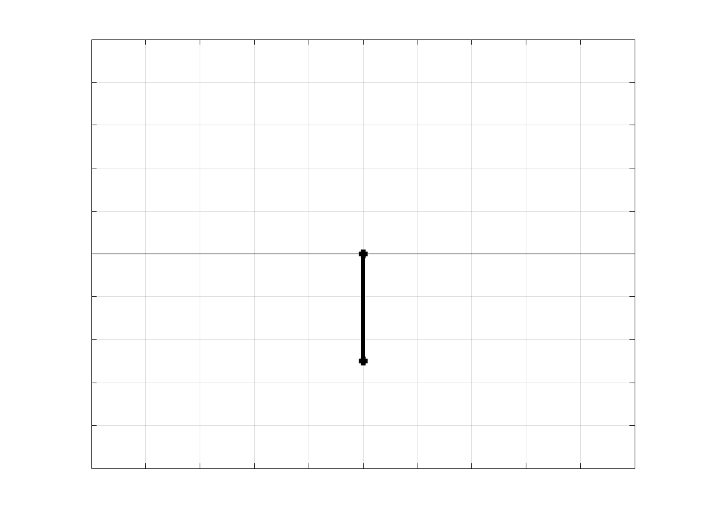
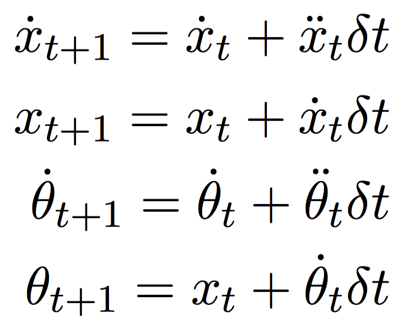
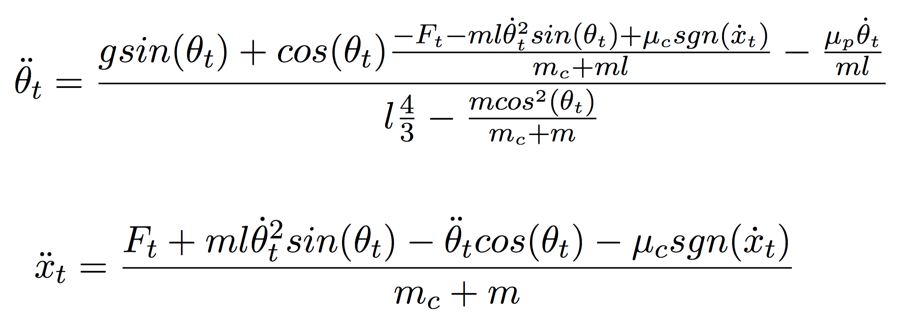
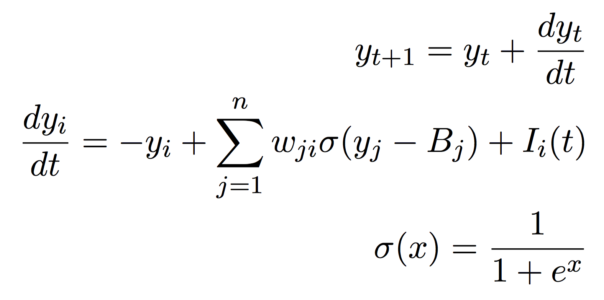
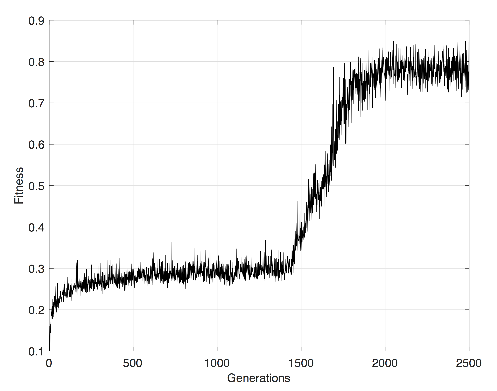

# Solving the cart-pole problem using an evolved neural network controller

<p align="center">
  
</p>

## Run settings
</br>
Methods:

* ```EvolveWeights.m``` - Contains parameters for evolution, neural network and evaluation.
* ```EvaluateWeight.m``` - Evaluates fitness score. Takes inputs ```weights```, ```nodes```, ```biases```, ```timesteps```
* ```TestWeight.m```- Takes same inputs as ```EvaluateWeights.m``` and plots the run.

To evolve a controller, run ```EvolveWeights.m```


## Method

### System
</br>
The system is a pole attached to a cart with one degree freedom. It is updated by applying Euler approximate numerical integrations

<p align="center">
  
</p>

using the following equations for the system

<p align="center">
  
</p>

### Network controller

The controller is a Continuous Time Recurrent Neural Network (CTRNN) with three fully connected layers - input, hidden and output, and is updated as follows

<p align="center">
  
</p>

where *w* refers to the weights and *B* to the biases.
### Individuals
The individuals/chromosomes for a controller are a random set of weights and biases for the network. 

### Fitness function

The fitness function returns the percentage of longest consecutive time in balance upright as well as within a boundary of the cart track. The fitness function in this case uses &plusmn; 36° and &plusmn; 5 meters as boundaries. 

### Selection and mutation

The upper half of the highest scoring individuals in the population are saved for the next generation. The lower half are replaced with 1% mutated versions of the upper half. A small number of the lowest scoring individuals are replaced with new, completely random individuals.

## Results

</br>
It took the controller around 2000 generations to get to a working state, something that could potentially been sped up by a tighter selection. The .gif in the beginning shows one of the working controllers, and below the best fitness over time can be seen:

<p align="center">
  
</p>

